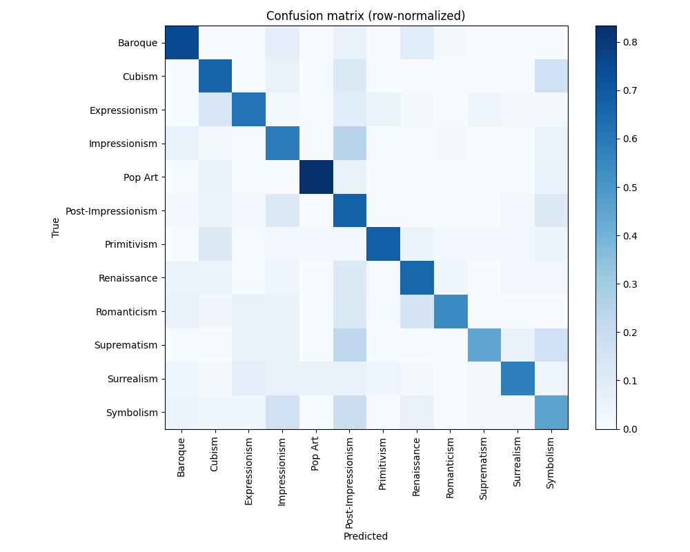

# 🎨 ArtStyle Predictor

**AI-powered art movement classifier and artist recommendation system, built with PyTorch and Streamlit.**

Upload a painting → get its predicted art movement (one of 12 classes) with confidence scores and a short description.
Pick a favorite artist → get similar artists, recommended by a content-based similarity model.

[](https://www.python.org/)
[](https://streamlit.io/)
[](https://pytorch.org/)

---

## Table of Contents

- [Overview](#overview)
- [Features](#features)
- [Project Structure](#project-structure)
- [Quick Start](#quick-start)
- [How It Works](#how-it-works)
- [Model Performance](#model-performance)
- [Dataset](#dataset)
- [Tech Stack](#tech-stack)
- [Acknowledgments](#acknowledgments)

---

## Overview

**ArtStyle Predictor** is a two-page Streamlit application:

1. **Style Classifier** (`ArtStyle.py`) — upload an image of a painting and a fine-tuned MobileNetV3-Small model (chosen by an architecture comparison) predicts which of 12 art movements it belongs to, along with a confidence score, a short description of the predicted style, and the top-5 most likely classes.
2. **Artist Recommender** (`pages/Artists.py`) — pick an artist from a dropdown and get a list of similar artists, computed from a precomputed content-based similarity matrix built on artist metadata (genre, nationality, era, bio).

The project began as an academic case study and was later rebuilt end to end: a reproducible training script (`train.py`), an architecture comparison, and retraining of the classifier from a completely non-functional state.

---

## Features

- 🖼️ **Drag-and-drop image classification** into 12 art movements: Baroque, Cubism, Expressionism, Impressionism, Pop Art, Post-Impressionism, Primitivism, Renaissance, Romanticism, Suprematism, Surrealism, Symbolism.
- 📊 **Confidence scores and top-5 predictions** for every uploaded image.
- 📖 **Style descriptions** pulled from a local CSV, with a link to the relevant Wikipedia article.
- 🎨 **Artist similarity recommendations** based on genre, nationality, era, and biography text.
- 🌐 **Live artist bios and portraits** fetched from Wikipedia at runtime, with a resilient two-stage lookup (exact stored URL first, fuzzy search only as a fallback).
- 🧪 **Diagnostic tooling** (`diagnose_artists.py`) to test the Wikipedia lookup for all artists in the dataset and pinpoint failures.

---

## Project Structure

```
art_style_classifier/
├── ArtStyle.py                    # Main Streamlit page — style classifier
├── pages/
│   └── Artists.py                 # Streamlit page — artist recommender
├── train.py                       # One-shot pipeline: prepare data → compare architectures → train → evaluate
├── data_preparation.py            # Maps artists to styles, cleans images, splits train/val/test
├── diagnose_artists.py            # Standalone diagnostic for the Wikipedia lookup
├── requirements.txt
├── artifacts/
│   ├── model.pth                  # Trained MobileNetV3-Small weights
│   ├── model_config.json          # Architecture, image size, test metrics
│   ├── class_names.json           # Class order used by the model
│   ├── architecture_comparison.*  # Quick comparison of 3 backbones (CSV + chart)
│   ├── confusion_matrix.png       # Test-set confusion matrix
│   └── similarity.pkl             # Precomputed artist-similarity matrix
├── assets/                        # Page banners
├── data/
│   ├── art_style.csv              # Style name, description, Wikipedia link
│   └── artists.csv                # Artist metadata (genre, nationality, bio, Wikipedia URL)
└── notebook/
    ├── modelling.ipynb            # Exploratory version of the training pipeline
    └── artists_recommender.ipynb  # Builds the artist similarity matrix
```

Streamlit auto-detects `pages/Artists.py` and adds it as a second page in the sidebar automatically — no manual routing needed.

---

## Quick Start

### Prerequisites
- Python 3.10+
- pip

### Installation

```bash
git clone https://github.com/Ananya2029/art-style-classifier.git
cd art-style-classifier
pip install -r requirements.txt
```

### Run

```bash
streamlit run ArtStyle.py
```

This opens the app at `http://localhost:8501`. Use the sidebar to upload a painting, or switch to the **Artists** page to explore recommendations.

> ⚠️ Run this command from *inside* the project folder. The app uses relative paths (`data/...`, `artifacts/...`, `assets/...`) that assume it's the current working directory.

---

## How It Works

### Style Classifier

```
Uploaded image
   → resize to 224×224, normalize (ImageNet mean/std)
   → MobileNetV3-Small backbone (ImageNet-pretrained via timm, fine-tuned)
   → 12-class classification head
   → softmax → predicted class + confidence
   → lookup description/Wikipedia link in data/art_style.csv
```

The architecture and class list are read from `artifacts/model_config.json` and `artifacts/class_names.json`, which `train.py` writes on every run, so the app can never drift out of sync with the checkpoint.

### Artist Recommender

```
Selected artist
   → look up row in data/artists.csv
   → look up precomputed cosine-similarity row in artifacts/similarity.pkl
   → return top-N most similar artists
   → fetch live bio/portrait for each from Wikipedia
```

Similarity is precomputed offline in `notebook/artists_recommender.ipynb` from a combined text profile of each artist's genre, nationality, years active, and biography, vectorized and compared via cosine similarity — the same general approach as a content-based recommender.

The Wikipedia lookup is a two-stage process: it first tries the artist's *exact* Wikipedia URL already stored in `artists.csv`, and only falls back to a live fuzzy search if that direct lookup fails.

---

## Model Performance

### Choosing the backbone

`train.py` first runs a quick comparison — 2 epochs each on a small data subset — of three ImageNet-pretrained backbones. It is a fast screening step, not a final score:

| Architecture | Validation macro-F1 (quick screen) | Time |
|---|---|---|
| **MobileNetV3-Small** | **0.276** | 108 s |
| EfficientNet-B0 | 0.136 | 430 s |
| ResNet18 | 0.101 | 199 s |

MobileNetV3-Small learned fastest and is ~4× quicker than EfficientNet-B0, so it was trained fully (up to 15 epochs, Adam, learning-rate reduction on plateau, early stopping on validation macro-F1).

### Test results

Held-out test set of **686 images** never seen during training or model selection:

| Metric | Value |
|---|---|
| **Test accuracy** | **62.1%** |
| **Macro F1** | **0.612** |
| Random-guess baseline (12 classes) | ~8.3% |

| Class | Test images | Accuracy |
|---|---|---|
| Pop Art | 18 | 83.3% |
| Baroque | 52 | 75.0% |
| Primitivism | 47 | 68.1% |
| Post-Impressionism | 46 | 67.4% |
| Cubism | 18 | 66.7% |
| Renaissance | 165 | 66.1% |
| Expressionism | 55 | 61.8% |
| Impressionism | 114 | 58.8% |
| Surrealism | 52 | 57.7% |
| Romanticism | 35 | 54.3% |
| Symbolism | 66 | 45.5% |
| Suprematism | 18 | 44.4% |



**What the errors show:** the most frequent confusions are between neighbouring movements — Impressionism ↔ Post-Impressionism, and Symbolism with both — which even people find hard to separate. Suprematism and Cubism had only 84 training images each, the smallest classes. Collecting more images for small classes and using class-balanced sampling are the clearest next steps.

## Dataset

The classifier is trained on a subset of the [**Best Artworks of All Time**](https://www.kaggle.com/datasets/ikarus777/best-artworks-of-all-time) dataset (Kaggle, ikarus777), which organizes images **by artist**, not by style. To get style-labeled training data:

1. Each artist is mapped to one of the 12 target style classes using the `genre` column in `data/artists.csv` (45 of the dataset's 50 artists map cleanly; the remaining 5 have genres outside the 12 target classes and are excluded).
2. Images are cleaned (corrupt, duplicate and tiny files removed) and capped at 120 per artist so prolific artists don't dominate a class.
3. Each artist's images are split 70% / 15% / 15% into train / validation / test — 4,440 images across 12 classes.

| Split | Images |
|---|---|
| Train | 3,097 |
| Validation | 657 |
| Test | 686 |
| **Total** | **4,440** |

---

## Tech Stack

- **App framework:** [Streamlit](https://streamlit.io/)
- **Deep learning:** [PyTorch](https://pytorch.org/), [timm](https://github.com/rwightman/pytorch-image-models) (MobileNetV3-Small; EfficientNet-B0 and ResNet18 compared)
- **Data:** pandas, NumPy
- **Recommender:** scikit-learn (cosine similarity), NLTK
- **Image handling:** Pillow, torchvision

---

## Acknowledgments

- Dataset: [Best Artworks of All Time](https://www.kaggle.com/datasets/ikarus777/best-artworks-of-all-time) (Kaggle, ikarus777)
- Pretrained backbones: [timm / pytorch-image-models](https://github.com/rwightman/pytorch-image-models) (rwightman)
- Artist bios and images: [Wikipedia](https://www.wikipedia.org/), via the public REST API
